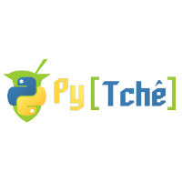

## Sobre

O grupo de usuários de Software Livre Tchelinux, em parceria com a [IMED Passo Fundo](https://imed.edu.br/), tem o prazer de convidar a comunidade para participar do evento que ocorrerá no dia **28 de Março de 2020 a partir das 8:30h** na IMED em Passo Fundo.

## Inscrições

As inscrições já se encontram abertas e podem ser feitas através do link abaixo: 

<a href="https://passofundo.tchelinux.org/inscricoes/" style="color:#ff4040"><b><h3>Clique aqui e faça já a sua inscrição! Vagas limitadas!<h3></b></a>

O evento tem **entrada franca**, porém os participantes são encorajados a doar 2kg de alimentos não perecíveis (exceto sal), que são doados a instituições de caridade da região. Os alimentos são recebidos no momento do credenciamento.

## Certificados

Serão fornecidos certificados digitais para os participantes do evento, que confirmaram sua presença. Para obtê-los, você deverá utilizar o email fornecido na sua inscrição para o evento.

**Importante:** Não esqueça de confirmar sua presença no credenciamento.

## Local

> **IMED Passo Fundo**
> Rua Senador Pinheiro, 304
> Vila Rodrigues
> Passo Fundo - RS

  <iframe src="https://www.google.com/maps/embed?pb=!1m18!1m12!1m3!1d3514.0970808711113!2d-52.39945368492557!3d-28.265072982564174!2m3!1f0!2f0!3f0!3m2!1i1024!2i768!4f13.1!3m3!1m2!1s0x94e2bf84ec8a7089%3A0xaed1f472fb179350!2sR.+Sen.+Pinheiro%2C+304+-+Vila+Rodrigues%2C+Passo+Fundo+-+RS%2C+99070-220!5e0!3m2!1sen!2sbr!4v1551593381119" width="600" height="450" frameborder="0" style="border:0" allowfullscreen></iframe>

## Apoio

### Institucional

### Patrocínio

### Divulgação

